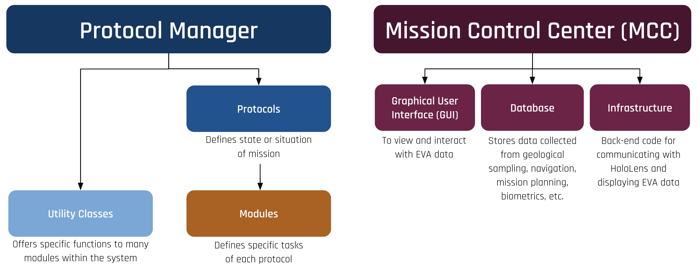
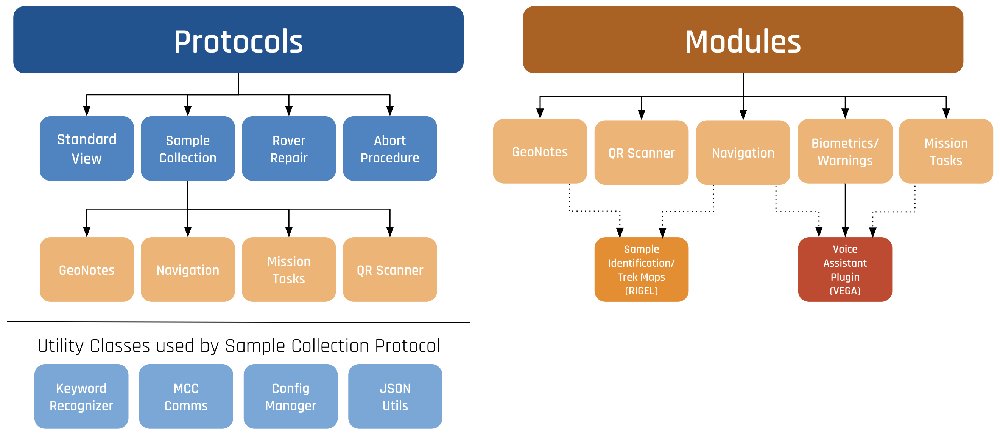

# ATLAS Infrastructure Overview

The ATLAS infrastructure is designed to interface with the Unity Engine which renders and displays the application. The team designed the infrastructure to use an element hierarchy. Each fundamental feature of the system, such as a QR code reader or the mini-map, is implemented in a module. Modules then can be combined to make a protocol, with each protocol providing functionality for various use cases, such as sample collection or rover repair. Protocols are then managed by the Protocol Manager, the driver of the application. This allows for a modular approach where views can be customized according to the protocol in place and the preferences of the user. The overarching infrastructure can be seen below: 

An example of how modules are integrated into a protocol can be seen in here:

More information on protocols and modules can be found on the [Protocols and Modules](protocols_and_modules.md) page.

A core part of the ATLAS system is handling communications with the CLAWS Mission Control Center, which allows for functionality such as live updates on mission tasks and photo transmission. More on this can be seen on the [Communications Manager and Workers](comm_manager_and_worker.md) page. 

