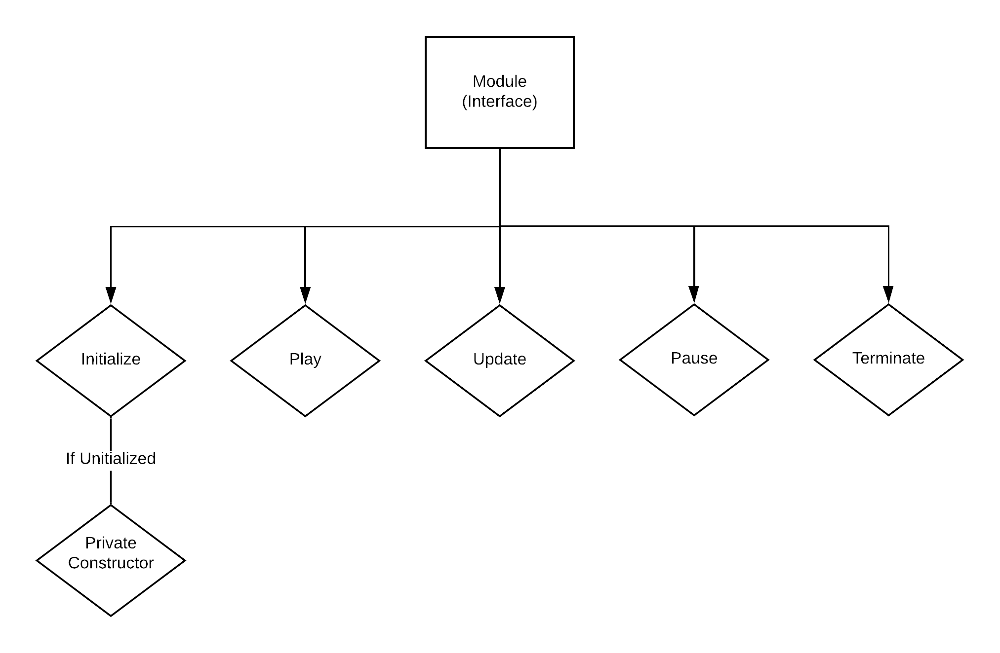

# Protocols and Modules

CLAWS is built off of Protocols and Modules. Protocols are managed by the Protocol Manager and encompass Modules, each of which make up a core piece of functionality of the system.

<h2>Protocol Manager</h2>

The Protocol Manager is responsible for handling the protocols. It is attached to a Unity game object that allows the Protocol Manager to automatically get called by the Unity Engine once the program has started. When the Protocol Manager is being initialized, there is a list of Protocols that can be populated and they will automatically become managed by the manager. The Protocol Manager performs transitions between various protocols once the criteria as defined in the transition method are met. The Protocol Manager informs Protocols what they need to do in order to become active/inactive and the Protocols themselves will do the work.


<h2>Protocol</h2>

Protocols are classes that consist of multiple Modules. A unique functionality of Protocols is there is no custom code needed ever. Each Protocol performs exactly the same, the only diversity being supplied by the Modules in question. Protocols call the appropriate methods for each Module when signaled by the Protocol Manager. Protocols are constructed when the Protocol Manager is initialized and need to be given a list of Modules to manage. Protocols perform intelligent transitions between different protocols, where if a Module is shared, it is not put to sleep when the first Protocol is set to inactive and then woken up when the second Protocol is set to active. Instead these Modules remain active the entire transition period as well.


<h2>Module</h2>

Modules make up the core functionality of the program. Each Module provides a single component that can be combined into a much larger program. Examples include a QRReader, Biometric display, and Mission Clock. All Modules are classes that implement the IModule interface. They are also all of the singleton type, which means there can only be one instance of that specific module at any time in the program. This allows for the Modules to be shared across Protocols, retaining state and contextual information. An example of how to implement a Module is shown in the FPSModule Class.



<h2>Creating your own Module!</h2>

Creating your own module is an important part of developing for ATLAS. To do this, you will want to start out with a brand new class as follows:

```
class MyGreatNewModule : IModule
{

  // Singleton Instance
  private static MyGreatNewModule instance;

  // Private constructor for singleton instance
  private MyGreatNewModule() 
  {
    // Constructor code
  }

  // GetInstance method
  public static IModule GetInstance()
  {
    if (instance == null)
    {
      instance = new MyGreatNewModule();
    }
    return instance;
  }

  // Play method, run once each time this module becomes active 
  public void Play()
  {
    // Code to run when module becomes active
  }

  // Update method, called once every frame while the module is active
  public void Update()
  {
    // Code to call every frame for this module
  }

  // Pause method, called once each time this module is about to become inactive
  public void Pause()
  {
    // Code to call when the module is about to become inactive
  }

  // Terminate method, called once when the program is about to end
  public void Terminate()
  {
    // Code to call when the program is about to end
  }
```

The above code is required for every single module. Any necessary member variables and other functions can be crated on top of this. 

The play method is used as a setup area for when the module is becoming active. This is useful for preparing UI elements, starting timers, or event listeners.

The update method is the heart of the module, as this is the place to put code that is called once a frame for the duration of the time the module is active. Useful for displaying text, updating telemetry and other numbers, and performing calculations.

The pause method is used to disable the module when it is no longer deemed active by the protocol manager. This is a great place to deactivate UI elements, store any file data that need to be preserved, and stop timers or event listeners.

The terminate method is unlikely to be called but this is called when the program is exiting. A good place to put some final safeties designed to protect file data.
